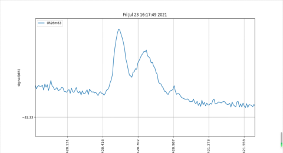

- ## 1.1 关于21cm氢谱线
  title:: 利用氢谱线绘制银河系的原理
	- 天然氢原子由一个质子和一个环绕质子的电子组成。除了轨道运动以外，质子和电子都有自旋。经典的看法将氢原子看作月球绕地球公转，同时月球和地球又分别自转。质子和电子的自旋为平行的氢原子（F=1）其能量比自旋是反平行的氢原子（F=0）高，当氢原子的状态由F=1变为F=0时，会放出频率为1420MHz、波长为21cm的电磁波。
	- {:height 233, :width 263}
	  图1.1：21cm氢谱线的产生
- ## 1.2 大气窗
	- 图1.2即为大气窗，横坐标为波长，纵坐标为大气不透明度。可见大气对不同波段电磁波的透明度是不同的，除了对光学波段是透明的，还对射电波段，即对厘米波到米波的一部分是透明的，所以21cm氢谱线显然能透过大气。
	- {:height 305, :width 588} 
	  图1.2：大气窗口
- ## 1.3 银河系悬臂结构
	- 银河系有5条主旋臂，如图3所示，它们分别是∶英仙臂、猎户臂、人马臂、矩尺臂和盾牌-南十字臂。银河系旋臂上聚集有大量的中性氢，故我们可以通过观测中性氢发出的21cm谱线来推测银河系的结构。
	-
	- 图1.3中的坐标系即银河坐标系，以银盘为平面，太阳为中心，太阳和银心的连线为银经0°，逆时针递增的坐标系。
	- 
	  图1.3：银河系旋臂结构
- ## 1.4绘制悬臂结构的几何原理
	- 假设我们是在日心观测氢谱线的，如图1.4所示，其中各参数的含义如下：
	  **S代表太阳
	  C代表银心
	  M代表氢分子团
	  V0为太阳绕银心转动的速度
	  R0为太阳到银心的距离
	  l为银河经度
	  V为气体云的速度
	  R为氢分子团到银心的距离
	  r为太阳和气体云之间的距离**
	- 
	  图1.4：简化的银河系几何图
	-
	- 当我们对准某个方向观测时，便已经知道氢分子团M所在的银经l了，只要再求出太阳到氢分子团的距离SM，即r，便可以确定氢分子团M在银河坐标系中的位置。而银河系旋臂上聚集有大量中性氢分子团，故我们可以通过求各个方位的氢气分子团的位置来推测银河系的结构，下面让我们来求r。
	-
	- 其中SM为观测视线，有如下几何关系：
	  $V_0$在视线上的投影为：$V_0 sin(c)=V_0sin(l)$
	  $V$在视线上的投影为：$Vcos(\alpha)$
	-
	- 易看出$cos(\alpha)=cos(a)=CT/R$
	  在三角形SCT中，$sin(l)=CT/R_0$
	  联立两式，得$cos(\alpha)=(R_0/R)sin(l)$
	  故有在视线上的投影为：$V(R_0/R)sin(l)$
	-
	- 视线上太阳和氢分子气团之间的相对速度为（$V$**在视线上的投影** $-$ $V_0$**在视线上的投影**）
	  即$V_r=V(R_0/R)sin(l)-V_0sin(l)$，也叫做径向速度
	-
	- 做一个假设简化，即$V=V_0$;当$R\gt 2\sim4 kpc$时，这个假设是合理的，
	  得到$V_r=V_0sin(l)(R_0/R-1)$
	-
	- 我们可以从观测的频谱得到径向速度$V_r$，而氢分子团所在银经$l$，太阳到银心的距离$R_0$以及绕银心转动的速度$V_0$均是已知的，故可以得出氢分子团到银心的距离$R$
	  $R=[R_{0} V_{0}sinl]/[V_r+V_0sin(l)]$
	-
	- 在图1.4三角形SMC中应用余弦定理，有
	  $R^2=R_0^2+r^2-2R_0rcosl$
	- 这里$r$为氢分子团到太阳的距离，由上式可得,
	  $r=\pm\sqrt{R^2-R_0^2 sin^2l} +R_0cosl$
	- 当两个根一正一负时，解唯一；当两个根都为正时，有两个解。
- ## 1.5 利用多普勒效应求径向速度$V_r$
	- 测量物体在宇宙中的运动,我们使用多普勒效应。就如同火车接近你时，其鸣笛声听起来有些尖锐，即声音频率变大；远离你时，其鸣笛声听起来有些低沉，即声音频率变小。对于电磁波而言，当观测者和发射体相互远离时，接收者接收的电磁波频率会小于静止时的频率；相互接近时，接收者接收的电磁波频率会大于静止时的频率，多普勒公式如下：
	- $$\frac{\Delta f}{f} = \frac{V_r}{c}$$
	- $\Delta f$：源发射的电磁波频率与接收者接收电磁波频率之差
	  $f$：发射源辐射的电磁波频率，即静止接收频率
	  $V_r$：源与接收者之间的相对速度
	  $c$：光速
	-
	- 如果观测者和中性氢静止，观测到的频率为应为1420.406MHz，即$f=1420.406MHz$，而光速$c$是已知的，依据多普勒公式，我们可以通过观测中性氢的频移量$\Delta f$，来推测出径向速度$V_r$
- ## 1.6 中性氢的频移量$\Delta f$
	- 我们对着一个方向进行观测，得到来自英仙座附近天球坐标为0h26m，+63°的频谱，如图1.6.1所示。横坐标是频率，纵坐标是信号强度，每个峰都代表所在位置有氢分子团发射线，由于多普勒效应，接收到的频率显然偏离了1420.406MHz。最左边那团可能是我们自身所在的银河系悬臂，右边的两团信号，来自另外两条悬臂。
	- {:height 268, :width 480}
	- 图1.6.1：英仙座坐标0h26m，+63°的观测频谱
	-
	- 天球坐标0h26m，+63°对应银经120°附近，在图1.6.2的银河坐标系上画出我们的观测视线。然后和图1.6.1对比一下，可以明显看出三个峰代表了来自三个悬臂上的中性氢信号，即猎户臂、英仙臂、外臂。
	-  
	  图1.6.2：观测视线上的三条旋臂3
	-
	- 然而我们是在地球上观测的，所以根据频移量算出来的是地球上观测点相对于氢分子团的径向速度。为了利用上述的一些公式，我们需要消去地球自转、公转的影响，得到日心和氢分子团之间的径向速度，这可以直接通过调用python的astropy天文包完成，在此便不详细讨论了。
	-
- ## 1.7 绘制银河系旋转曲线的几何关系
	- 银河系旋转曲线以天体距银心的距离为横坐标，以天体绕银心转动为纵坐标绘制的曲线。通过中性氢的频谱，我们也可以绘制出该曲线。
	-
	- 假如我们向既定视线上观测，如图1.7所示，视线通过了银河系的四条旋臂，那么我们会看到四团聚积的氢分子气体，由于这四团氢分子相对于观测者的径向速度都不同，根据多普勒效应，便可以看到四个峰，对应四条旋臂上的氢分子团。
	- 
	  1.7 绘制旋转曲线的几何关系
	-
	- 关于图中径向速度的说明：本来的频谱横坐标为频率，但是根据第五部分的多普勒公式，我们可以把频率均转化为径向速度，这样便可直接读出峰值对应的径向速度，即中性氢和日心的相对速度。
	-
	- 关于频谱中的峰为什么是弥漫开来的：每个旋臂上氢分子本身就是弥漫开来的，速度也是不尽相同，但是每个峰的最高处对应的径向速度代表着：大多数的氢分子都是以这个速度相对于观测者运动的，这大多数的氢分子便代表着旋臂的主要部分。
	-
	- 根据1.4节，我们已经得到化简后的$V_r=V_0sin(l)(R_0/R-1)$，在既定视线上，显然氢分子团距离银心的距离$R$最小时，有最大的$V_r$。
	-
	- 即$R_{min}$对应$V_{r max}$，我们观察不同方向，得到一系列$R_{min}$和$V_{r max}$
	  把一系列$R_{min}$和$V_{r max}$代入未化简的$V_r=V(R_0/R)sin(l)-V_0sin(l)$，便可以解得一系列的$V$，即氢分子团绕银心转动的速度。
	- 我们以$R_{min}$为横坐标，$V$为纵坐标，便可以绘制出银河系旋转曲线。
	-
	- $R_{min}=R_0sin(l)$是容易求得的，我们目前要做的工作是求取$V_{r max}$。然而这种事情还是挺复杂的，因为峰是弥漫开来的。不妨做一个简化，即以$V_r$**最大时对应的峰值**衰减到**其右边频谱的平均值**（即蓝色线右边的频谱）为标准，取这个平均值（红线）和谱线的交点对应的$V_r$为$V_{rmax}$。
-