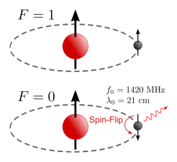

- ## 1.1 关于21cm氢谱线
- 天然氢原子由一个质子和一个环绕质子的电子组成。除了轨道运动以外，质子和电子都有自旋。经典的看法将氢原子看作月球绕地球公转，同时月球和地球又分别自转。质子和电子的自旋为平行的氢原子（F=1）其能量比自旋是反平行的氢原子（F=0）高，当氢原子的状态由F=1变为F=0时，会放出频率为1420MHz、波长为21cm的电磁波。
- {:height 233, :width 263}
  图1.1：21cm氢谱线的产生
- ## 1.2 大气窗
- 图1.2即为大气窗，横坐标为波长，纵坐标为大气不透明度。可见大气对不同波段电磁波的透明度是不同的，除了对光学波段是透明的，还对射电波段，即对厘米波到米波的一部分是透明的，所以21cm氢谱线显然能透过大气。
-  
  图1.2：大气窗口
- ## 1.3 银河系悬臂结构
- 银河系有5条主旋臂，如图3所示，它们分别是∶英仙臂、猎户臂、人马臂、矩尺臂和盾牌-南十字臂。银河系旋臂上聚集有大量的中性氢，故我们可以通过观测中性氢发出的21cm谱线来推测银河系的结构。
  图1.3中的坐标系即银河坐标系，以银盘为平面，太阳为中心，太阳和银心的连线为银经0°，逆时针递增的坐标系。
- 
  图1.3：银河系旋臂结构
- ## 绘制悬臂结构的几何原理
- 假设我们是在日心观测氢谱线的，如图1.4所示，其中各参数的含义如下：
  S代表太阳
  C代表银心
  M代表氢分子团
  V0为太阳绕银心转动的速度
  R0为太阳到银心的距离
  l为银河经度
  V为气体云的速度
  R为氢分子团到银心的距离
  r为太阳和气体云之间的距离
- 
  图1.4：简化的银河系几何图
- 当我们对准某个方向观测时，便已经知道氢分子团M所在的银经l了，只要再求出太阳到氢分子团的距离SM，即r，便可以确定氢分子团M在银河坐标系中的位置。而银河系旋臂上聚集有大量中性氢分子团，故我们可以通过求各个方位的氢气分子团的位置来推测银河系的结构，下面让我们来求r。
-
- 其中SM为观测视线，有如下几何关系：
  在视线上的投影为：
  在视线上的投影为：
- 易看出
  在三角形SCT中，
  联立两式，得
  故有在视线上的投影为：